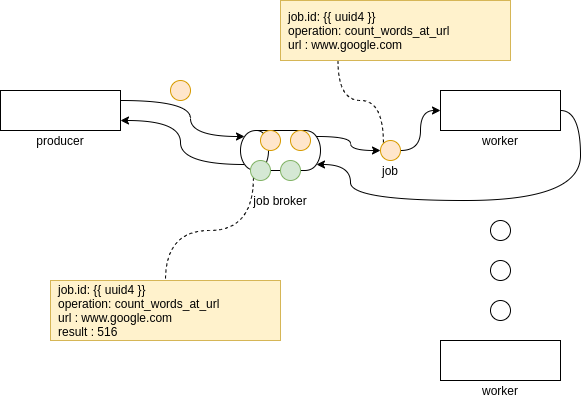

## Spike - RQ as task distribution pattern


``RQ`` is a library designed to implement a simple task distribution system based
on Redis as distribution broker.

* [RQ : Easy queues job for python](https://python-rq.org/)

A task distribution pattern, also called producer / consumer is an easy way to create
distributed architecture. It allow to scale independently the producer and the consumer
instance thanks to a job broker in the middle. In the case of RQ, the job broker is
`Redis`



A task distribution pattern allow to queue jobs and process them in a background task.
In this example, we will design an architecture to fetch website url and count the number of words
in background workers.

A distribution pattern offers advantages as :

* the producer is working even if the worker stop working
* if a worker stop working, the job can be retry after a specified timeout
* the number of worker can scale independently of the number of producer
* the number of producer can scale independently of the number of worker
* the job broker persist message if it has to restart

Alternatives to RQ are ``celery``, ``dramatiq``, ...

## Getting started

This spike implements [word counter example](https://python-rq.org/) described in ``rq``.
You need two terminal to run it.

1. Terminal 1 - InRun the system (job broker and one worker)

```bash
honcho start
```

2. Terminal 2 - Submit a job through command line

* ``trigger`` :

```bash
$ pipenv run mycommand trigger --url www.google.fr
```

* ``result`` :

```bash
pipenv run mycommand result --jobid {{ uuid4 }}
```
## The latest version

You can find the latest version to ...

```bash
git clone https://github.com/FabienArcellier/blueprint-cli-multicommands-python.git
```

## Contributors

* Fabien Arcellier

## License

MIT License

Copyright (c) 2018 Fabien Arcellier

Permission is hereby granted, free of charge, to any person obtaining a copy
of this software and associated documentation files (the "Software"), to deal
in the Software without restriction, including without limitation the rights
to use, copy, modify, merge, publish, distribute, sublicense, and/or sell
copies of the Software, and to permit persons to whom the Software is
furnished to do so, subject to the following conditions:

The above copyright notice and this permission notice shall be included in all
copies or substantial portions of the Software.

THE SOFTWARE IS PROVIDED "AS IS", WITHOUT WARRANTY OF ANY KIND, EXPRESS OR
IMPLIED, INCLUDING BUT NOT LIMITED TO THE WARRANTIES OF MERCHANTABILITY,
FITNESS FOR A PARTICULAR PURPOSE AND NONINFRINGEMENT. IN NO EVENT SHALL THE
AUTHORS OR COPYRIGHT HOLDERS BE LIABLE FOR ANY CLAIM, DAMAGES OR OTHER
LIABILITY, WHETHER IN AN ACTION OF CONTRACT, TORT OR OTHERWISE, ARISING FROM,
OUT OF OR IN CONNECTION WITH THE SOFTWARE OR THE USE OR OTHER DEALINGS IN THE
SOFTWARE.
